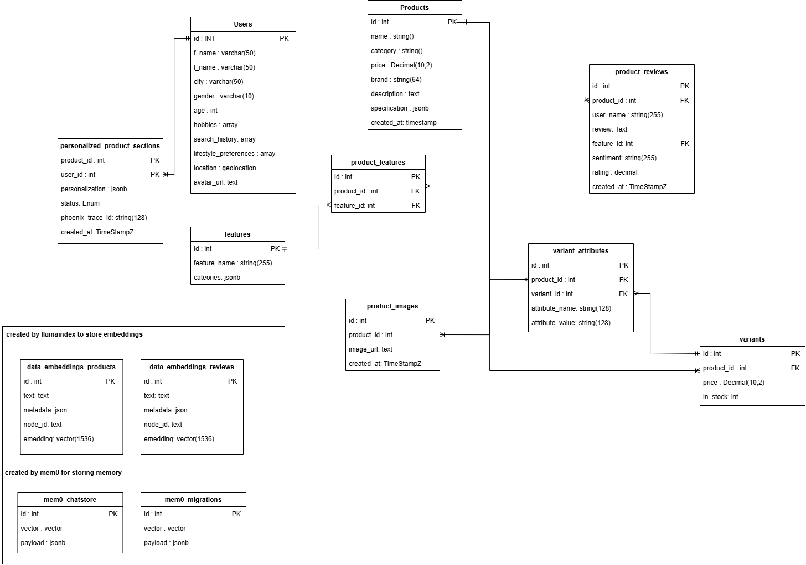
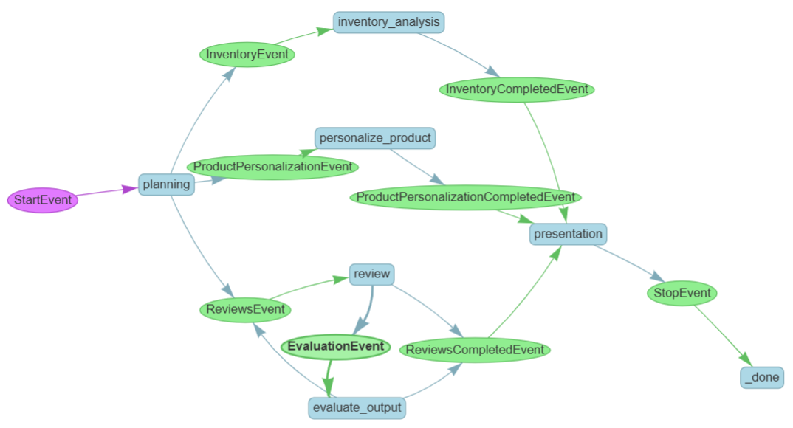

# AgenticShop: Reimagined Shopping Experience for the Era of AI Agents
This repository showcases the power of agentic flow with LlamaIndex, leveraging the functionality of multi-agent workflows. The solution has been developed to enhance the shopping experience for individuals with a keen interest in purchasing electronic gadgets. It is a one-click solution that is easy to test and deploy with the help of the Azure Developer CLI. Refer to the architecture diagram for the complete layout:

- [Key Features](#key-features)
- [Architecture Diagram](#architecture-Diagram)
- [Solution Accelerator Deployment](#solution-accelerator-deployment)
- [Tear Down](#tear-down)
- [Development Methods](#development-methods)
- [Setup Devcontainer](#setup-devcontainer)
- [Local Environment Setup Without Devcontainer](#local-environment-setup-without-devcontainer)

## Key Features
The retail solution accelerator provides the following features:
- Personalized product details based on user profile
- Elevated user experience
- Multi-agent workflows allow seamless handling of multiple tasks
- Debug panel using Arize Phoenix tracing for agent triggers and tracking

## ERD


## Architecture Diagram


## Solution Accelerator Deployment
### Prerequisites
The following are prerequisites for deploying this solution:
1. [Azure Developer CLI](https://learn.microsoft.com/en-us/azure/developer/azure-developer-cli/install-azd?tabs=winget-windows%2Cbrew-mac%2Cscript-linux&pivots=os-linux)
2. [Azure CLI](https://learn.microsoft.com/en-us/cli/azure/install-azure-cli)
3. [Azure CLI extension](https://learn.microsoft.com/en-us/cli/azure/azure-cli-extensions-overview) `rdbms-connect`
4. An Azure account with an active subscription.
5. [Python 3.12](https://www.python.org/downloads/)
6. [Powershell Core](https://learn.microsoft.com/en-us/powershell/scripting/install/installing-powershell-on-windows?view=powershell-7.5) (for Windows users only)

### Deployment Steps
#### Clone the Repository
Clone the repository. Once done, navigate to the repository:
```sh
git clone https://github.com/Azure-Samples/postgres-agentic-shop.git
cd postgres-agentic-shop
```

#### Log in to your Azure account
To log in to Azure CLI, use the following command:
```sh
az login
```
To log in to Azure Developer CLI, use this command:
```sh
azd auth login
```
If the above command fails, use the following flag:
```sh
azd auth login --use-device-code
```

#### Create a new Azure Developer environment
Initialize and create a new `azd` environment. Provide a name for your `azd` environment:
```sh
azd init
```

#### Grant permissions to azd hook scripts
If you are deploying the solution on Linux OS, grant the following permissions to scripts in the `azd-hooks` directory:
```sh
cd azd-hooks
sudo chmod +x predeploy.sh
sudo chmod +x preprovision.sh
sudo chmod +x postprovision.sh
```
If you are deploying the solution on Windows OS, grant the following permissions to the current session to execute `pwsh` scripts located in the `azd-hooks` directory:
```sh
Set-ExecutionPolicy -Scope Process -ExecutionPolicy Bypass
```
If you are deploying in a Unix-like environment on Windows OS (for instance Cygwin, MinGW), grant the following permissions to the current session to execute `pwsh` scripts:
```sh
pwsh -NoProfile -Command "Set-ExecutionPolicy -Scope CurrentUser -ExecutionPolicy Bypass"
```

#### Solution Deployment
Run the following command to provision the resources. **Note** that this solution uses postgres authentication for creating connection to database. It is recommended to change the `ADMINISTRATOR_LOGIN_USER` and `ADMINISTRATOR_LOGIN_PASSWORD` parameters before deployment as best security practice.
```sh
azd up
```

Once this command is executed, the prompt asks for the subscription for deployment, two locations (one for the solution accelerator resources and another for Azure OpenAI models), and the resource group to create.
Make sure that you have enough Azure OpenAI model quota in the region of deployment. The Azure OpenAI quota required for `GlobalStandard` **deployment type** for this solution is listed below. This configuration can be changed from the `main.parameters.json` file in the `infra` directory using the following parameters:
- **`GlobalStandard` GPT-4o:** 150K TPM - `AZURE_OPENAI_CHAT_DEPLOYMENT_CAPACITY`
- **`GlobalStandard` text-embedding-ada-002:** 120K TPM - `AZURE_OPENAI_EMBED_DEPLOYMENT_CAPACITY`
**Note:** After creating the resource group, the workflow prompts the user for the Azure Container Apps deployment. Input `yes` as shown below. The deployment might take some time and will provide progress updates in the terminal as well as on the Azure Portal.
```sh
Do you want to deploy Azure Container Apps? (y/n): yes
```

### Troubleshooting
1. The troubleshooting guide for `azd cli` is [here](https://learn.microsoft.com/en-us/azure/developer/azure-developer-cli/troubleshoot?tabs=Browser).
2. A validation error occurs when unsupported characters, such as `_`, `#` etc. are used while initializing or creating a new environment or resources. Refer to [rules and restrictions](https://learn.microsoft.com/en-us/azure/azure-resource-manager/management/resource-name-rules) for naming conventions.
3. A scope error occurs when the user does not have appropriate permissions when running `azd cli`. Update user permissions to the subscription level.
4. When `The resource entity provisioning state is not terminal` error occurs, restart the deployment using the `azd up` command.

## Tear Down
To destroy all the resources that have been created in the steps above, as well as remove any accounts deployed by the solution accelerator, use the following command:
```sh
azd down --purge
```
The `--purge` flag deletes all the accounts permanently.

### Personalization Workflow
Below is the LlamaIndex workflow generated via its visualization tool:


## Setup Devcontainer
### Prerequisites

Before setting up the devcontainer, ensure you have the following installed on your machine:

1. **Docker**
    - [Install Docker](https://docs.docker.com/get-docker/) for your operating system and ensure the Docker daemon is running.

2. **Visual Studio Code**
    - [Download VS Code](https://code.visualstudio.com/).

3. **Dev Containers Extension**
    - Install the [Dev Containers extension](https://marketplace.visualstudio.com/items?itemName=ms-vscode-remote.remote-containers) in VS Code.

4. [Deployment Prerequisites](#prerequisites)

### Environment Setup

1. **Deploy OpenAI & PostgreSQL Server on Azure**
    - Follow the [deployment steps](#deployment-steps).
    - After creating the resource group, the workflow prompts the user for the Azure Container Apps deployment. Input `no` to skip Azure Container Apps deployment.

2. **Create Environment Files**
    - For each of the following directories, create a `.env` file and populate it with the required environment variables:
      - `frontend/.env`
      - `backend/.env`
      - `arize-ai/.env`
    - Refer to the project documentation or sample `.env.example` files (if provided) for the required variables.

### Building and Opening the Devcontainer

1. **Open the Project in VS Code**
    - Launch VS Code and open the root folder of this repository.

2. **Rebuild and Reopen in Container**
    - Press `Ctrl + Shift + P` (or `Cmd + Shift + P` on Mac) to open the Command Palette.
    - Type and select `Dev Containers: Rebuild and Reopen in Container`.
    - The initial build may take 5-10 minutes as dependencies are installed and the environment is set up.

3. **Subsequent Usage**
    - For future sessions, you can use `Dev Containers: Reopen in Container` for faster startup, unless you modify files in the `.devcontainer/` directory, in which case a rebuild is required.

### Tear Down

To destroy all the resources that have been created in the steps above, as well as remove any accounts deployed by the solution accelerator, use the following command:
```sh
azd down --purge
```
The `--purge` flag deletes all the accounts permanently. **Note:** If you want to perform a complete Azure native deployment after local development:
    - Destroy the resources first by using the above command.
    - Create a new azd environment by executing the `azd env new` command.
    - Deploy using the `azd up` command.
    - After creating the resource group, the workflow prompts the user for the Azure Container Apps deployment. Input `yes`.

### Additional Notes

- Ensure Docker has sufficient resources allocated (CPU, memory) for smooth operation.
- If you encounter issues, refer to the [Dev Containers documentation](https://code.visualstudio.com/docs/devcontainers/containers) or check the output panel in VS Code for troubleshooting information.
- Any changes to the `.devcontainer/` configuration will require a rebuild of the container.

## Local Environment Setup (Without Devcontainer)

You can set up and run the solution locally without using a devcontainer. Follow the steps below to configure your environment.

### Prerequisites

Ensure you have the following installed on your machine:

1. **Docker Engine**
    [Install Docker](https://docs.docker.com/get-docker/) and ensure the Docker daemon is running.

2. **Python 3.12**
    [Download Python 3.12](https://www.python.org/downloads/release/python-3120/) and verify it is available in your `PATH`.

3. **Poetry**
    [Install Poetry](https://python-poetry.org/docs/#installation) for Python dependency management.

4. **Node.js & npm**
    [Install Node.js](https://nodejs.org/) (recommended version: 18.x or later) and ensure `npm` is available.

5. [Deployment Prerequisites](#prerequisites)

### Setup Steps

1. **Configure Environment Variables**
    For each of the following directories, create a `.env` file and populate it with the required environment variables:
    - `frontend/.env`
    - `backend/.env`
    - `arize-ai/.env`
    Refer to the project documentation or any provided `.env.example` files for the required variables.

2. **Deploy Azure Resources**
    Deploy OpenAI and Postgres resources on Azure using the Bicep templates.
    - Follow the [deployment steps](#deployment-steps).
    - After creating the resource group, the workflow prompts the user for the Azure Container Apps deployment. Input `no` to skip Azure Container Apps deployment.
    Ensure you have the [Azure CLI](https://learn.microsoft.com/en-us/cli/azure/install-azure-cli), Azure CLI `rdbms-connect` [extension](https://learn.microsoft.com/en-us/cli/azure/azure-cli-extensions-overview), and [Azure Developer CLI](https://learn.microsoft.com/en-us/azure/developer/azure-developer-cli/install-azd?tabs=winget-windows%2Cbrew-mac%2Cscript-linux&pivots=os-linux) installed and are logged in.

3. **Install Backend Dependencies**
    Navigate to the `backend` directory and install dependencies:
    ```sh
    cd backend
    poetry install
    ```

4. **Install Frontend Dependencies**
    Navigate to the `frontend` directory and build the frontend:
    ```sh
    cd ../frontend
    npm install
    ```

5. **Start Arize AI Container**
    Navigate to the `arize-ai` directory and build/run the container:
    ```sh
    cd ../arize-ai
    docker build -t arize-ai .
    docker run --name arize-ai-container -p 6006:6006 arize-ai
    ```

6. **Update Backend Configuration**
    Update the Arize AI-related variables in `backend/.env` to match the running container and any required endpoints.

7. **Run Backend and Frontend Services**
    - **Backend:**
      In the `backend` directory, activate the poetry environment:
      ```sh
      uvicorn src.main:app --host 0.0.0.0 --port 8000 --log-config logging_config.yaml --reload
      ```
    - **Frontend:**
      In the `frontend` directory, start the frontend development server:
      ```sh
      npm run dev
      ```

### Tear Down

To destroy all the resources that have been created in the steps above, as well as remove any accounts deployed by the solution accelerator, use the following command:
```sh
azd down --purge
```
The `--purge` flag deletes all the accounts permanently. **Note:** If you want to perform a complete Azure native deployment after local development:
    - Destroy the resources first by using the above command.
    - Create a new azd environment by executing the `azd env new` command.
    - Deploy using the `azd up` command.
    - After creating the resource group, the workflow prompts the user for the Azure Container Apps deployment. Input `yes`.

### Additional Notes

- Ensure all services are running and accessible at their respective ports.
- If you encounter issues, check the logs for each service and verify your environment variables.
- For troubleshooting Azure deployments, refer to the [Azure Developer CLI troubleshooting guide](https://learn.microsoft.com/en-us/azure/developer/azure-developer-cli/troubleshoot).
- Make sure Docker has sufficient resources allocated for smooth operation.
